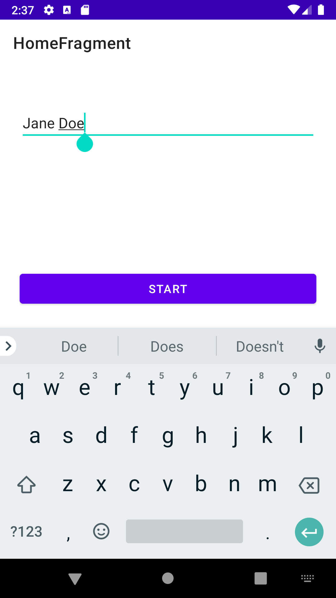
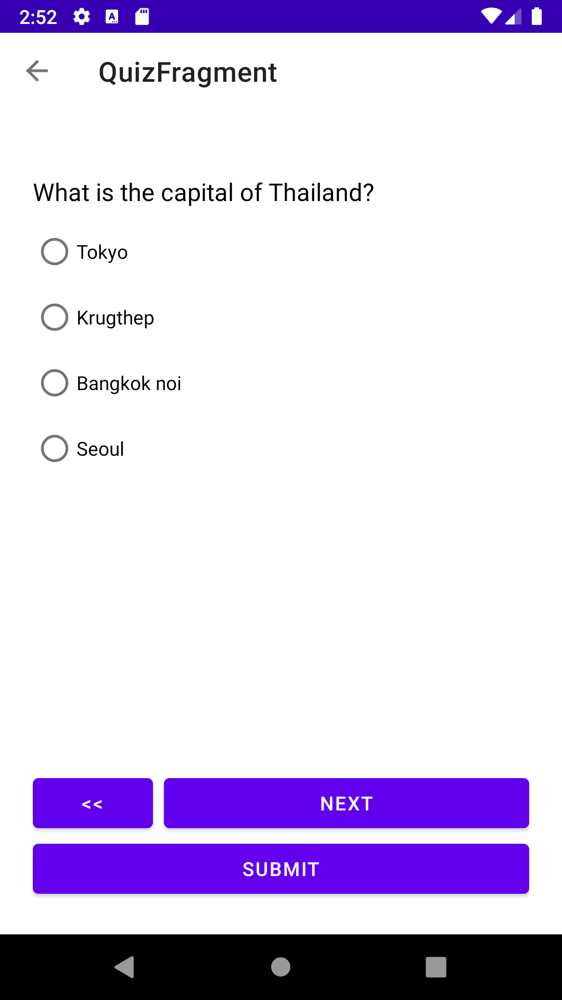
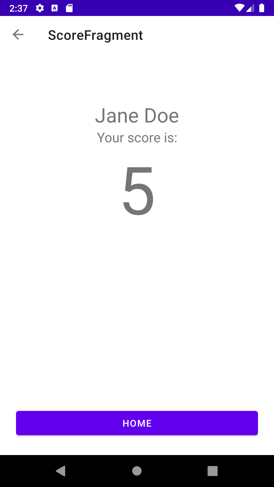

# Android Engineering Assignment

This is a hands-on coding exercise.

The Android project contained in this folder has some issues that prevent it from functioning properly.

## Application Specs

This is a quiz application consisting of 3 screens. You are being asked to add the 4th screen:

1. **Welcome Screen** - The user enter his name then click "START". Name
   is required and the user cannot proceed without entering some text. 
   User wil be notified if name is missing.
   
2. **Quiz Screen** - There are 10 multiple choice questions.
   Users can navigate between questions before submitting the quiz for scoring.
   The questions have to be present in a Random order. Everytime user start new quiz the order change.
   
3. **Result Screen** - Once the user taps "Submit" the app will take user to this
   screen and show user's total score and user name. 
   Is impossible for the user to change response after this screen.
   Clicking back will open the Welcome Screen
   
4. **TODO: Scoreboard Screen** - Display a list of people who have taken the quiz, their score, and
   their rank. Every name have to be different and are not allowed duplicate.
   Screen must be accessible from Welcome screen.
   Data have to be still available after re-start.
   
## Objectives

1. Fix all bugs
2. Implement the missing feature (marked as **TODO**) in the **Application Specs** section below
3. Implement tests for scorecard screen and add missing tests if required.   
3. Improve the UX/UI to support better the flow.
4. Refactor/reorganize the app code for modularization/maintainability
5. Everything you think can make app better!
